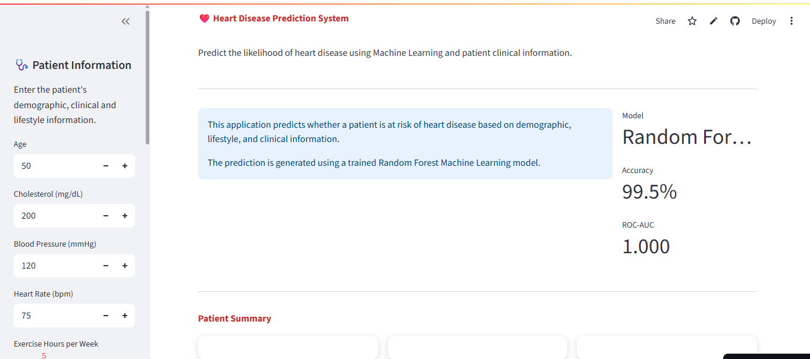
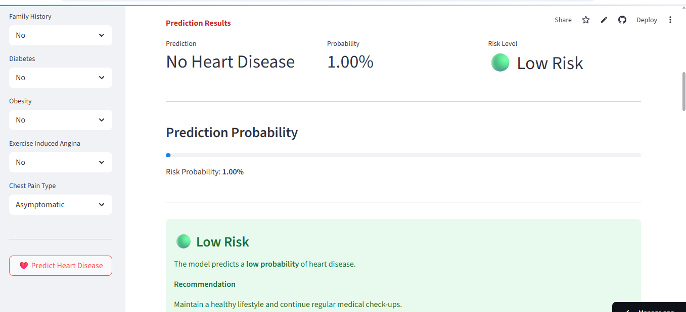
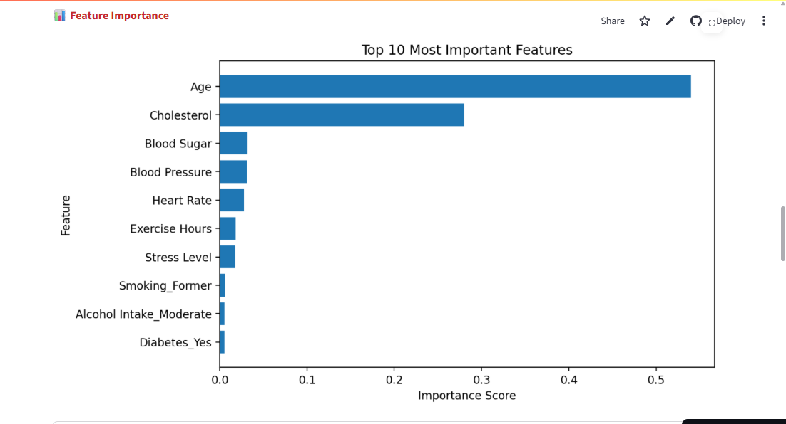
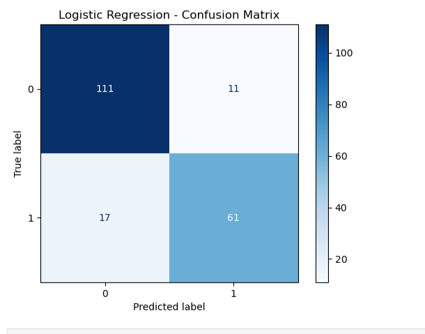

# ❤️ Heart Disease Prediction using Machine Learning

## 📌 Project Overview

Heart disease remains one of the leading causes of death worldwide. Early identification of individuals at high risk can support timely medical intervention and improve patient outcomes.

This project develops a **Machine Learning-based Heart Disease Prediction System** using patient demographic, clinical, and lifestyle information. Multiple classification algorithms were trained and evaluated, with **Random Forest** selected as the final model due to its excellent predictive performance.

The project also includes a fully interactive **Streamlit web application** that enables users to enter patient information and receive an instant heart disease risk prediction.

---

## 🎯 Objectives

* Analyze heart disease risk factors.
* Perform comprehensive exploratory data analysis (EDA).
* Build and compare multiple machine learning classification models.
* Identify the most important predictors of heart disease.
* Deploy an interactive prediction application using Streamlit.

---

## 📊 Dataset

The dataset contains **1,000 patient records** with **16 variables**, including demographic information, clinical measurements, lifestyle factors, and a binary heart disease outcome.

### Features

* Age
* Gender
* Cholesterol
* Blood Pressure
* Heart Rate
* Smoking Status
* Alcohol Intake
* Exercise Hours
* Family History
* Diabetes
* Obesity
* Stress Level
* Blood Sugar
* Exercise-Induced Angina
* Chest Pain Type
* Heart Disease (Target)

---

## 🔍 Exploratory Data Analysis

The project includes extensive EDA, including:

* Dataset overview
* Missing value analysis
* Duplicate detection
* Class distribution
* Age distribution
* Gender analysis
* Smoking analysis
* Alcohol intake analysis
* Diabetes analysis
* Family history analysis
* Obesity analysis
* Exercise-induced angina analysis
* Chest pain analysis
* Correlation heatmap
* Numerical feature distributions
* Boxplots for outlier detection
* Feature relationship analysis

---

## ⚙️ Data Preprocessing

The preprocessing workflow includes:

* Missing value verification
* Feature selection
* One-Hot Encoding of categorical variables
* Train-test split (80/20)
* Feature scaling using StandardScaler
* Feature name preservation for deployment

---

## 🤖 Machine Learning Models

The following models were trained and evaluated:

* Logistic Regression
* Decision Tree
* Random Forest
* Gradient Boosting

### Model Performance

| Model               | Accuracy   | ROC-AUC   |
| ------------------- | ---------- | --------- |
| Logistic Regression | **86.0%**  | **0.951** |
| Decision Tree       | **100.0%** | **1.000** |
| Random Forest       | **99.5%**  | **1.000** |
| Gradient Boosting   | **100.0%** | **1.000** |

> **Note:** The near-perfect performance of the tree-based models suggests that the dataset contains highly separable patterns. These results should be interpreted within the context of this dataset and may not directly reflect performance on real-world clinical data.

---

## 📈 Feature Importance

The Random Forest model was used to identify the most influential predictors of heart disease.

Feature importance analysis provides insight into which variables contributed most to the model's predictions.

---

## 🚀 Streamlit Application

The deployed application allows users to:

* Enter patient information
* Predict heart disease risk
* View prediction probability
* Receive risk interpretation
* Explore feature importance
* Access model information

---

## 🛠️ Technologies Used

* Python
* Pandas
* NumPy
* Matplotlib
* Seaborn
* Scikit-learn
* Joblib
* Streamlit
* Jupyter Notebook

---

## 📷 Application Screenshots

### Dashboard




---

### Prediction Result




---

### Feature Importance



---

### Confusion Matrix




---

## 📁 Project Structure

```text
Heart-Disease-Prediction/
│
├── app.py
├── Heart Disease Prediction.ipynb
├── heart_disease_dataset.csv
├── requirements.txt
├── README.md
│
├── models/
│   ├── heart_disease_model.pkl
│   ├── scaler.pkl
│   └── feature_names.pkl
│
├── images/
│   ├── dashboard.png
│   ├── prediction.png
│   ├── feature_importance.png
│   └── confusion_matrix.png
│
└── LICENSE
```

---

## ▶️ Installation

Clone the repository:

```bash
git clone https://github.com/YOUR_USERNAME/Heart-Disease-Prediction.git
```

Navigate to the project:

```bash
cd Heart-Disease-Prediction
```

Install dependencies:

```bash
pip install -r requirements.txt
```

Run the Streamlit application:

```bash
streamlit run app.py
```

---

## 📌 Future Improvements

* Hyperparameter tuning
* Cross-validation optimization
* SHAP explainability
* Model calibration
* Docker containerization
* Cloud deployment enhancements
* Integration with electronic health records (EHR)

---

## 📂 Dataset

The dataset used in this project is publicly available.

**Source:** Hospital Billing Dataset (Kaggle)

🔗 https://www.kaggle.com/datasets/...

> Note: The dataset is not included in this repository due to its size. Please download it from the source above and place it in the `data/` folder before running the analysis.


## ⚠️ Disclaimer

This project is intended for educational and research purposes only.

The predictions generated by this application are **not** medical diagnoses and should **not** replace professional clinical judgment or consultation with qualified healthcare providers.

---

## 👩‍💻 Author

**Anita Okechukwu**

Healthcare Data Analyst | Machine Learning Enthusiast | Registered Midwife

Passionate about applying data science and machine learning to improve healthcare decision-making through predictive analytics and interactive data applications.
